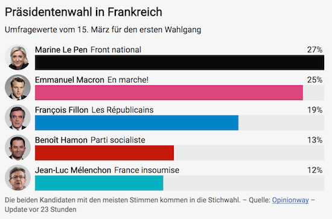
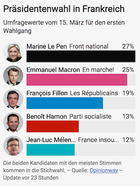
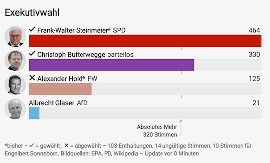

# Q Election Executive [](https://travis-ci.com/nzzdev/Q-election-executive) [](https://greenkeeper.io/)

**Maintainer**: [Danijel Beljan](https://github.com/dnlbln)

Q election executive is one tool of the Q toolbox to display results of executive elections. Test it in the [demo](https://editor.q.tools/).

## Table of contents

- [Installation](#installation)
- [Configuration](#configuration)
- [Development](#development)
- [Testing](#testing)
- [Deployment](#deployment)
- [Functionality](#functionality)
- [License](#license)

## Installation

```
git clone git@github.com:nzzdev/Q-election-executive.git
cd ./Q-election-executive
nvm use
npm install
npm run build
```

[to the top](#table-of-contents)

## Configuration

There is one env variable `IMAGE_SERVICE_URL` to be defined. It should contain a URL with 3 parameters that will get replaced before the URL is used to load the images.
`{key}` will be replaced by the string Q-server stored as the key when the file got uploaded through Q-servers `/file` endpoint provided by the [file plugin](https://github.com/nzzdev/Q-server/blob/dev/plugins/file/index.js)
`{width}` is replaced by the width the image should be loaded
`{format}` will be `png` or `webp` (a `picture` element is used in the HTML with multiple `source` elements)
Example: `https://q-images.nzz.ch/{key}?width={width}&format={format}`

[to the top](#table-of-contents)

## Development

Start the Q dev server:

```
npx @nzz/q-cli server
```

To run the tool create a new file called `dev.js` and use the env-variable listed above with the local urls.

```
process.env.IMAGE_SERVICE_URL = "https://q-images.nzz.ch/{key}?width=108&format=png&auto=webp";
require('./index.js');
```

You can then start the tool with:

```
node dev.js
```

[to the top](#table-of-contents)

## Testing

The testing framework used in this repository is [Code](https://github.com/hapijs/code).

Run the tests:

```
npm run test
```

### Implementing a new test

When changing or implementing...

- A `route`, it needs to be tested in the `e2e-tests.js` file
- Something on the frontend, it needs to be tested in the `dom-tests.js` file

[to the top](#table-of-contents)

## Deployment

We provide automatically built [docker images](https://hub.docker.com/r/nzzonline/q-election-executive/).
There are three options for deployment:

- Use the provided images
- Build your own docker images
- Deploy the service using another technology

### Use the provided docker images

1. Deploy `nzzonline/q-election-executive` to a docker environment
2. Set the ENV variables as described in the [configuration section](#configuration)

[to the top](#table-of-contents)

## Functionality

If a tool then it can use this reference to the Q-server documentation about Q-tools:

The tool structure follows the general structure of each Q tool. Further information can be found in [Q server documentation - Developing tools](https://nzzdev.github.io/Q-server/developing-tools.html).

Q Election Executive uses [svelte3](https://svelte.dev) to render the markup on server-side.

### Features

Here is what the tool looks like on mobile and other devices. The example shows survey results of the presidential elections in France in 2017. It's in German because we do not have multilanguage support (yet).




Each graphic has the following three sections:

- Header: contains specified title, subtitle and legend
- Main Part: displays results for each candidate. Optionally candidate pictures are shown on the left. As soon as the results are final a checkmark for elected candidates or a crossmark for voted off candidates are displayed. Additionally all candidates who have not been elected have b/w pictures and a less saturated color bar. If applicable a majority line will be shown.
- Footer: contains further notes (e.g. how many municipalities already finished counting), source(s) and update information

Here is a completely fictional example to show you the different states (currently part of the government, elected, voted off) and the majority line:



### data with error margin

In case `withErrorMargin` is true, the rendering looks different to show the error margin.


If `withErrorMargin` is set to true, the candidates `votes` input is hidden, instead the inputs `errorMargin.lower`, `errorMargin.bestGuess` and `errorMargin.upper` are shown. These should be used to enter the errorMargin best guess as long as the lower and upper bound of the error margin.

[to the top](#table-of-contents)

### Options

#### hideUpdatedDate


This option will hide the date shown in the footer when it's updated.

#### Display options

Display options can be set before embedding the graphic in the article.

##### hideTitle

Allows to hide the title

[to the top](#table-of-contents)

## License

Copyright (c) 2019 Neue Zürcher Zeitung. All rights reserved.

This software is licensed under the [MIT](https://github.com/nzzdev/Q-election-executive/blob/feat-test-doc/LICENSE) License.

[to the top](#table-of-contents)
